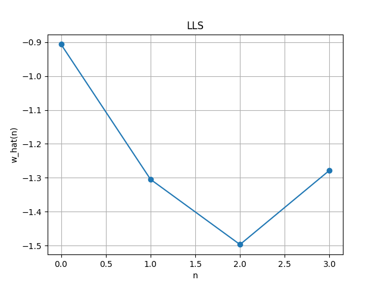
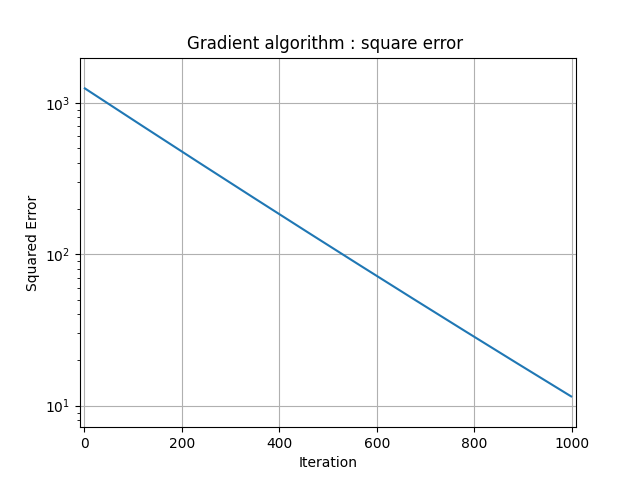
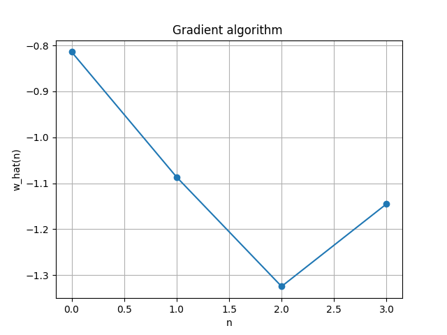
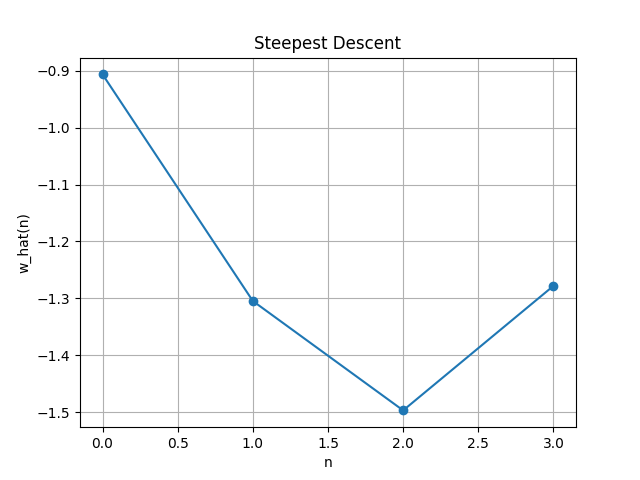

# Optimization Methods for Linear Regression

## Objective

Implement and compare three fundamental optimization algorithms for solving the **linear least-squares** minimization problem:

$$\hat{w} = \arg\min_w \|Aw - y\|^2$$

This lab introduces the Object-Oriented Programming (OOP) framework used throughout the course for implementing solvers.

## Techniques

| Method | Type | Description |
|--------|------|-------------|
| **Linear Least Squares (LLS)** | Closed-form | Direct solution via the normal equation: $\hat{w} = (A^T A)^{-1} A^T y$ |
| **Gradient Descent (GD)** | Iterative | Fixed learning rate $\gamma$, iterates $w_{k+1} = w_k - \gamma \nabla J(w_k)$ |
| **Steepest Descent (SD)** | Iterative | Adaptive step size via $\gamma_k = \|\nabla J\|^2 / (\nabla J^T H \nabla J)$ |

## Implementation Details

- A random matrix $A \in \mathbb{R}^{100 \times 4}$ and a true weight vector $w$ are generated
- The target vector is computed as $y = Aw$ (noiseless scenario)
- Each solver estimates $\hat{w}$ and compares it against the ground truth
- The shared `SolveMinProbl` base class (in `utils/minimization.py`) provides common functionality via inheritance

## Results

### LLS — Exact Recovery
LLS recovers the exact solution in one step (as expected for a noiseless system).

### Gradient Descent — Convergence
GD converges to the solution, with speed depending on the learning rate $\gamma = 10^{-5}$.

| | |
|:---:|:---:|
|  |  |
| Squared error vs iterations (log scale) | Estimated weights |

### Steepest Descent — Adaptive Learning Rate
SD converges faster than GD thanks to the optimal adaptive step size. It matches the LLS solution exactly.

### Key Observations
- **LLS** and **SD** recover the exact same weight vector — confirming SD convergence
- **GD** with $\gamma = 10^{-5}$ converges but hasn't fully reached the optimum at 1000 iterations
- SD is less sensitive to hyperparameter tuning since $\gamma$ is computed optimally at each step

## Files

| File | Description |
|------|-------------|
| `optimization_demo.py` | Main script demonstrating LLS, GD, and SD |
