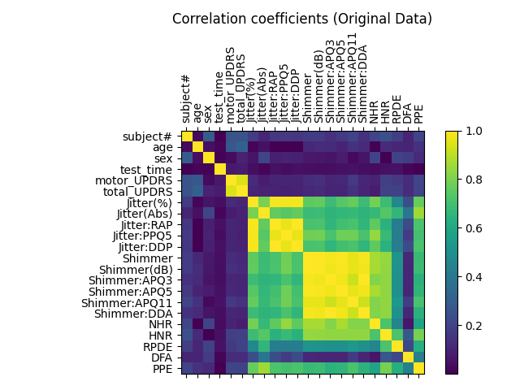
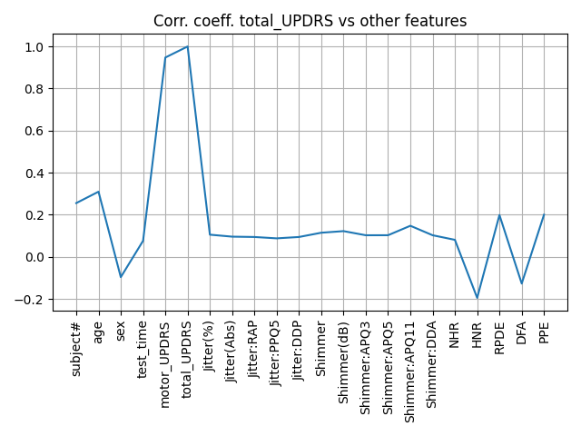
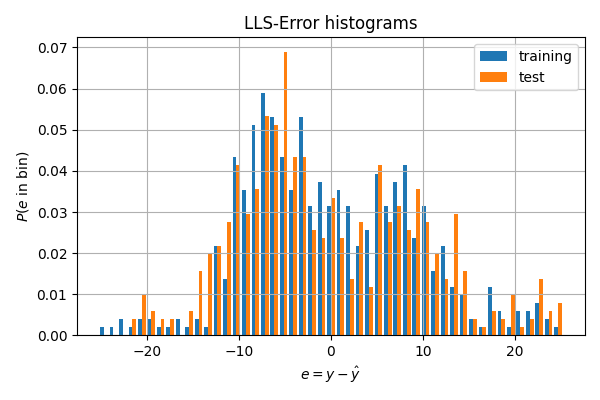
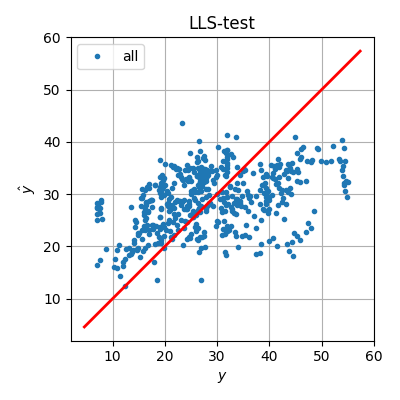

# Parkinson's Disease — Linear Regression (LLS & Steepest Descent)

## Objective

Predict the **Total UPDRS** score (Unified Parkinson's Disease Rating Scale) from voice recordings and clinical data, comparing **Linear Least Squares** and **Steepest Descent** solvers.

The clinical question: can voice analysis alone replace in-person neurological examinations for monitoring Parkinson's disease remotely?

## Dataset

[Parkinsons Telemonitoring](https://archive.ics.uci.edu/ml/datasets/Parkinsons+Telemonitoring) — 990 samples, 42 patients, 22 features including biographical data (age, sex), clinical scores (motor_UPDRS), and voice features (jitter, shimmer, HNR, etc.).

## Pipeline

1. **Exploratory Analysis** — Correlation matrix and feature analysis
2. **Preprocessing** — Z-score normalization (computed on training set only), shuffling, 50/50 train-test split
3. **Feature Engineering** — Dropped `Jitter:DDP` and `Shimmer:DDA` (collinear), excluded `motor_UPDRS` to test voice-only prediction
4. **Regression** — LLS (closed-form) and Steepest Descent (iterative)
5. **Evaluation** — MSE, R², correlation coefficient, error histograms

## Results

### Correlation Analysis
The covariance matrix reveals high collinearity between jitter/shimmer variants and strong correlation between `motor_UPDRS` and `total_UPDRS`.

| | |
|:---:|:---:|
|  |  |
| Full correlation matrix | Correlation with total_UPDRS |

### Regression Performance (without motor_UPDRS)

| Metric | Training (LLS) | Test (LLS) | Training (SD) | Test (SD) |
|--------|:--------------:|:----------:|:-------------:|:---------:|
| **MSE** | 82.46 | 98.93 | 82.53 | 98.61 |
| **R²** | 0.257 | 0.160 | 0.256 | 0.162 |
| **Corr. coeff.** | 0.507 | 0.414 | 0.506 | 0.416 |

### Error Distribution & Regression Scatter (LLS)

| | |
|:---:|:---:|
|  |  |
| Error histogram (training vs test) | Predicted vs true values |

### Key Findings

- **Voice features alone yield poor predictions** (R² ≈ 0.16 on test data), confirming that voice analysis cannot replace clinical motor assessment
- LLS and SD converge to essentially the same solution, validating the SD implementation
- Voice-based monitoring may serve as a **complementary screening tool**, but not a standalone diagnostic method

## Files

| File | Description |
|------|-------------|
| `parkinson_regression.py` | Main pipeline: data loading, preprocessing, LLS & SD regression |
| `data/parkinsons_updrs.csv` | Parkinsons Telemonitoring dataset |
