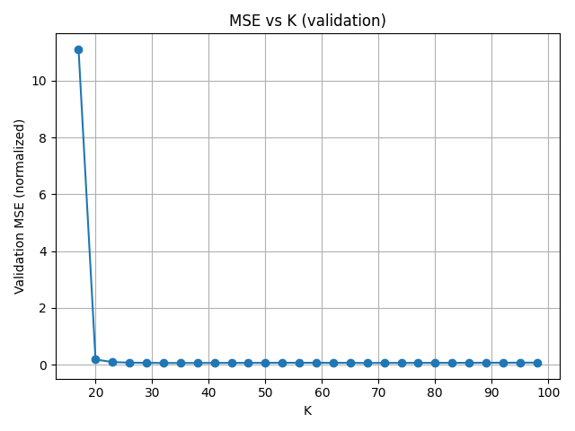
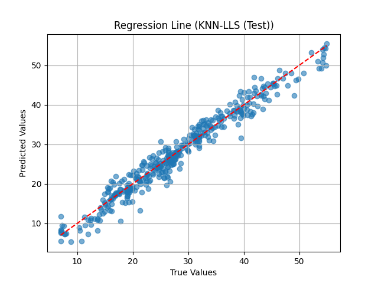
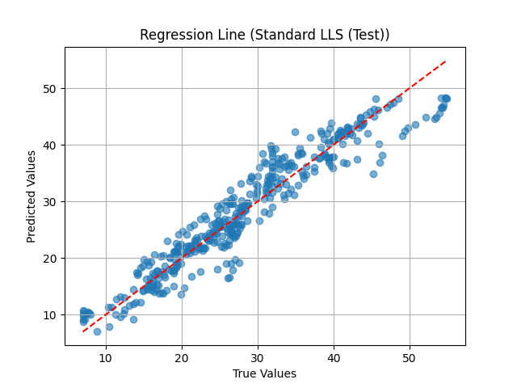
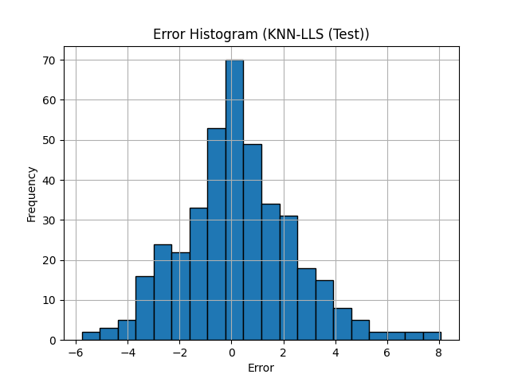
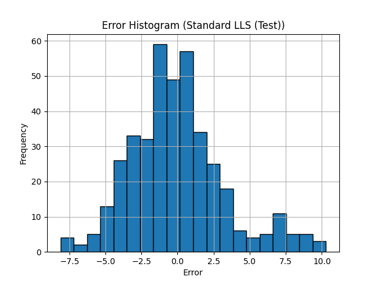

# Parkinson's Disease — KNN-LLS Regression

## Objective

Improve UPDRS prediction accuracy by replacing global linear regression with a **local** approach: **K-Nearest Neighbors combined with Linear Least Squares (KNN-LLS)**. The key insight is that *"every function is linear if you zoom enough"* — by fitting many small local models, we can approximate non-linear relationships.

## Dataset

[Parkinsons Telemonitoring](https://archive.ics.uci.edu/ml/datasets/Parkinsons+Telemonitoring) — Same dataset as Lab 02, but now including `motor_UPDRS` as a regressor and using a train/validation/test split (40%/20%/40%).

## Approach

### KNN-LLS Algorithm
For each test point $x_0$:
1. Find the $K$ nearest neighbors in the training set (Euclidean distance)
2. Fit a local LLS model using only those $K$ points: $\hat{w} = (A^T A + \varepsilon I)^{-1} A^T y$
3. Predict: $\hat{y}_0 = x_0 \cdot \hat{w}$

The regularization term $\varepsilon I$ (ridge regression) ensures invertibility when $K < F$.

### Hyperparameter Optimization
The optimal $K$ is found by sweeping $K \in [17, 100]$ on the **validation set** (not the test set, to avoid data leakage).

## Results

### K Optimization
The validation MSE curve shows a minimum at **K = 35**, balancing bias and variance.

### KNN-LLS vs Standard LLS

| Metric | KNN-LLS (Test) | Standard LLS (Test) |
|--------|:--------------:|:-------------------:|
| **MSE** | 4.87 | 10.55 |
| **R²** | 0.957 | 0.907 |
| **Corr. coeff.** | 0.979 | 0.953 |

### Regression Scatter Plots

| | |
|:---:|:---:|
|  |  |
| KNN-LLS: points tightly follow the 45° line | Standard LLS: wider dispersion |

### Error Distribution

| | |
|:---:|:---:|
|  |  |
| KNN-LLS: narrower error distribution | Standard LLS: wider spread |

### Key Findings

- **KNN-LLS dramatically outperforms global LLS** (R² = 0.957 vs 0.907) by adapting to local data structure
- The method fits many small linear models rather than one global model, capturing non-linear patterns piece-wise
- The training R² (0.988) is higher than test R² (0.957), which is expected and shows no severe overfitting

## Files

| File | Description |
|------|-------------|
| `knn_regression.py` | KNN-LLS pipeline with K optimization and comparison against standard LLS |
| `data/parkinsons_updrs.csv` | Parkinsons Telemonitoring dataset |
