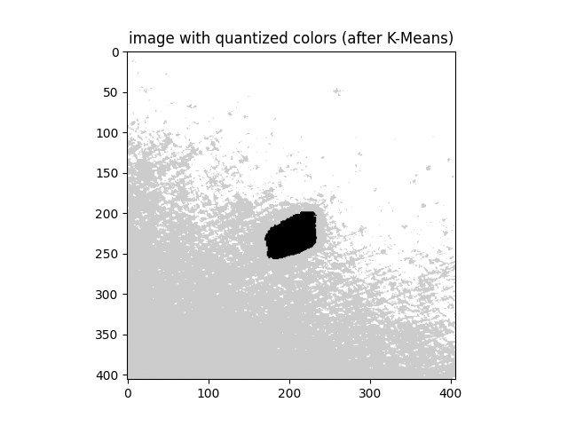
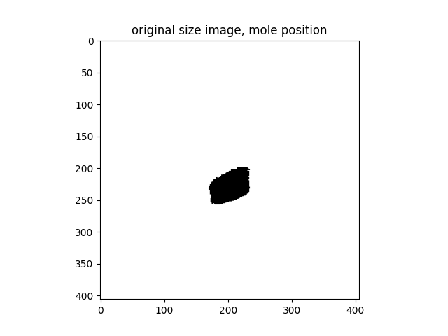
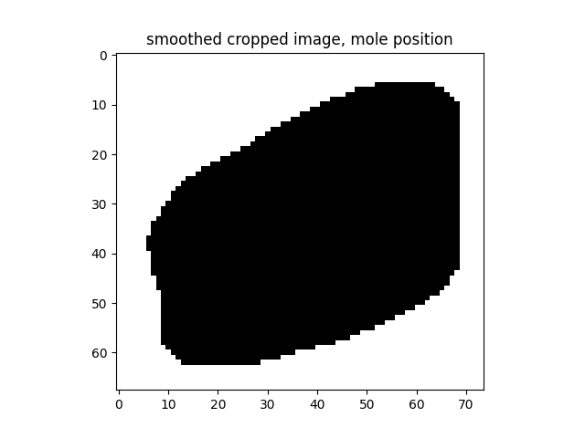
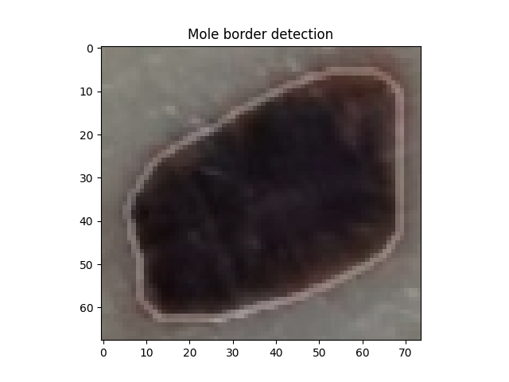

# Dermoscopic Mole Segmentation

## Objective

Develop an automated pipeline for **mole border detection** from dermoscopic images, as a preliminary step toward melanoma diagnosis. A key diagnostic feature is the ratio between the mole's border length and the circumference of an equivalent circle — higher values indicate greater border irregularity and higher cancer risk.

## Pipeline

1. **Grayscale Conversion** — RGB image → single-channel intensity
2. **K-Means Clustering** — Color quantization to 3 clusters (3 representative gray levels)
3. **DBSCAN** — Density-based clustering on the darkest pixels to identify the mole region, filtering out small noise clusters
4. **Cropping** — Extract the bounding box around the detected mole
5. **Median Filtering** — Smooth the binary mole mask to remove noise
6. **Sobel Edge Detection** — Horizontal and vertical gradient filters to find the mole contour
7. **Border Overlay** — Superimpose the detected border on the original color image

## Results

### K-Means Color Quantization
The grayscale image is reduced to 3 representative colors. The darkest cluster corresponds to the mole region.

### DBSCAN Mole Detection
DBSCAN clusters nearby dark pixels. The largest cluster closest to the image center is selected as the mole. Small clusters and noise (label = -1) are discarded.

### Smoothed Mole Mask
A median filter smooths the binary mask, removing isolated pixels and filling small gaps.

### Final Border Detection
Sobel filters detect the gradient magnitude, producing the mole contour overlaid on the original image.

### Key Observations
- K-Means effectively separates the mole from skin and background using only 3 clusters
- DBSCAN handles irregular mole shapes better than simple thresholding, and automatically rejects outliers
- The Sobel-based contour extraction produces a clean border suitable for shape analysis

## Files

| File | Description |
|------|-------------|
| `mole_segmentation.py` | Full segmentation pipeline: K-Means → DBSCAN → Sobel |
| `data/images/` | Dermoscopic images (low risk, medium risk, melanoma) |
