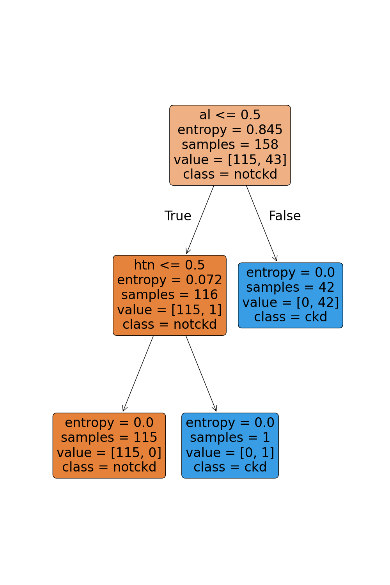
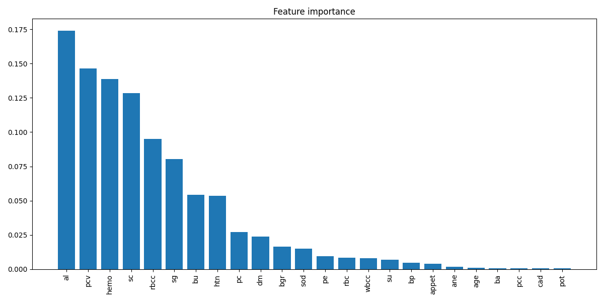

# Chronic Kidney Disease Classification

## Objective

Classify patients as **CKD** (Chronic Kidney Disease) or **not CKD** using Decision Trees and Random Forests, with a focus on handling **missing data** through regression-based imputation (LLS) vs. median imputation.

## Dataset

[Chronic Kidney Disease](https://archive.ics.uci.edu/ml/datasets/Chronic_Kidney_Disease) — 400 patients, 24 features (numerical + categorical), with significant missing values (up to 12 missing features per row).

## Approach

### Missing Data Strategies
1. **LLS Regression Imputation** (`x_new`): For each patient with missing values, train a local LLS model using the complete-case subset to predict the missing features from the available ones. Categorical features are then snapped to their nearest valid value.
2. **Median Imputation** (`y_new`): Simply replace each missing value with the median of that feature from the training set.

### Classification Models
- **CART Decision Tree** — Entropy-based splitting for interpretable models
- **Random Forest** — Ensemble of 100–1000 trees for improved accuracy

## Results

### Decision Tree Structure
The trained tree reveals which features are most discriminant for CKD diagnosis:

### Feature Importance (Random Forest)
Random Forest identifies the most predictive features across the ensemble:

### Classification Accuracy

| Model | Test Set | Accuracy |
|-------|----------|:--------:|
| Decision Tree | x_new (LLS imputed) | **92.8%** |
| Random Forest (100 trees) | x_new (LLS imputed) | **97.7%** |
| Random Forest (1000 trees) | x_new (LLS imputed) | **96.8%** |
| Random Forest (100 trees) | y_new (median imputed) | 88.5% |
| Random Forest (1000 trees) | y_new (median imputed) | 87.8% |
| Random Forest (1000 trees) | 50/50 split on y_new | **100%** |

### Key Findings

- **LLS imputation dramatically outperforms median imputation** (97.7% vs 88.5% with RF-100), preserving feature correlations that simple median replacement destroys
- Random Forest improves over a single Decision Tree (97.7% vs 92.8%), leveraging ensemble diversity
- The 50/50 split experiment achieves 100% accuracy because training and test data come from the same imputed distribution — this highlights the risk of evaluating on non-independent data

## Files

| File | Description |
|------|-------------|
| `kidney_classification.py` | Full pipeline: data loading, imputation (LLS + median), Decision Tree, Random Forest |
| `data/chronic_kidney_disease.arff` | UCI CKD dataset |
