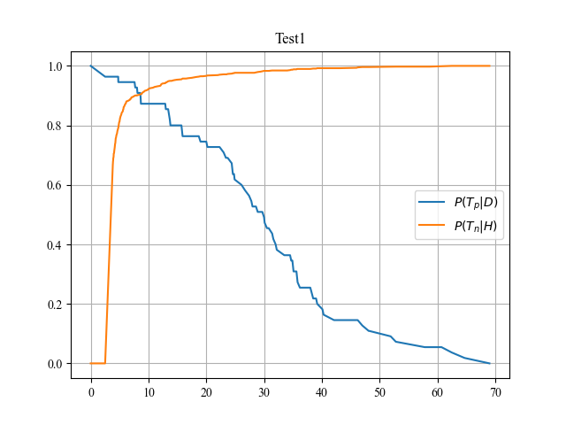
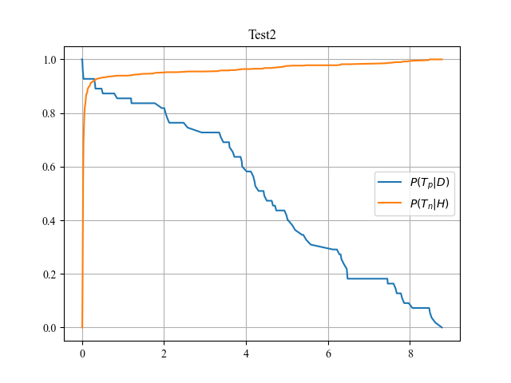
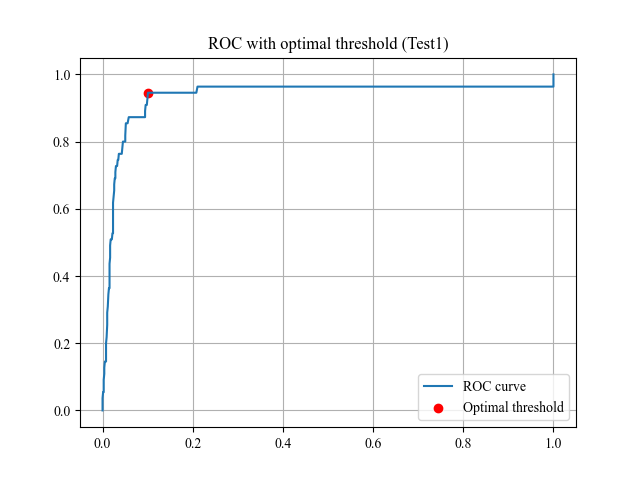
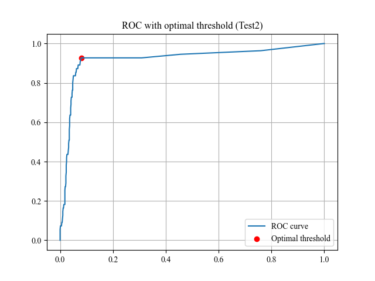

# COVID-19 Serological Test Analysis

## Objective

Evaluate and compare two **IgG serological tests** for COVID-19 diagnosis using ROC analysis, determining the optimal classification threshold for each test via **Youden's J statistic**.

## Dataset

COVID-19 serological study — IgG antibody titre values from two different tests, with nasopharyngeal swab results as ground truth (positive/negative). Uncertain swab results are excluded. **DBSCAN** is used to remove outliers before analysis.

## Approach

1. **Sensitivity/Specificity curves** — Sweep all possible thresholds to compute TPR and TNR
2. **ROC curve** — Plot TPR vs FPR; compute AUC both manually (trapezoidal integration) and via scikit-learn
3. **Youden's J statistic** — Find optimal threshold: $J = \text{Sensitivity} + \text{Specificity} - 1$
4. The optimal threshold maximizes $J$, balancing sensitivity and specificity

## Results

### Sensitivity & Specificity vs Threshold

| | |
|:---:|:---:|
|  |  |
| Test 1 | Test 2 |

### ROC Curves with Optimal Threshold

| | |
|:---:|:---:|
|  |  |
| Test 1 — AUC = 0.948 | Test 2 — AUC = 0.938 |

### Test Comparison

| Metric | Test 1 | Test 2 |
|--------|:------:|:------:|
| **AUC** | 0.948 | 0.938 |
| **Optimal Threshold** | 7.59 | 0.30 |
| **Sensitivity** | 94.5% | 92.7% |
| **Specificity** | 89.9% | 92.0% |

### Key Findings

- Both tests achieve excellent AUC (> 0.93), confirming strong discriminative power
- **Test 1** has higher sensitivity (94.5%), better for screening (fewer missed positives)
- **Test 2** has higher specificity (92.0%), better for confirmation (fewer false positives)
- Manual AUC computation via trapezoidal integration closely matches scikit-learn's implementation, validating the approach

## Files

| File | Description |
|------|-------------|
| `covid_roc_analysis.py` | ROC analysis pipeline: DBSCAN outlier removal, sensitivity/specificity, AUC, Youden's J |
| `data/covid_serological_results.csv` | COVID-19 serological test results |
