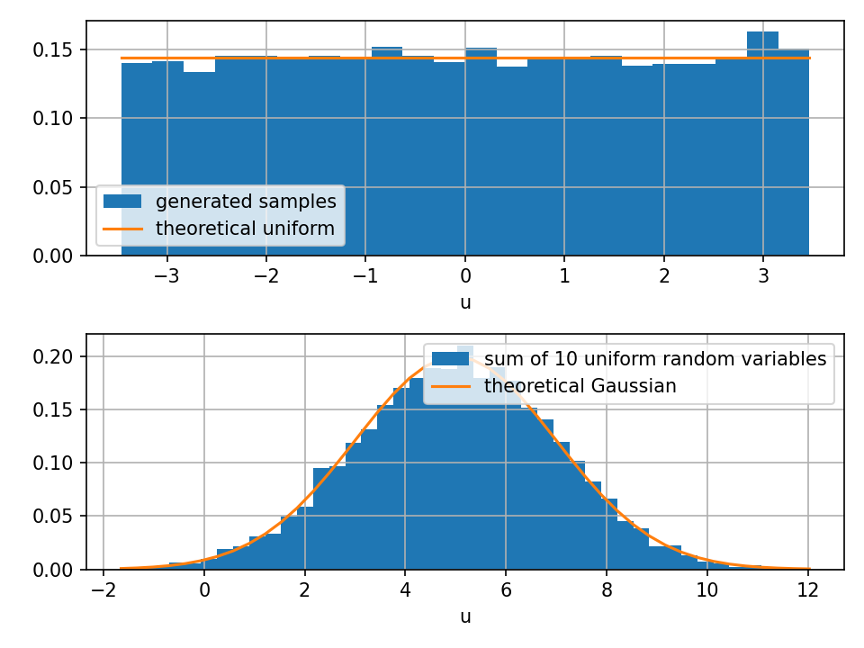
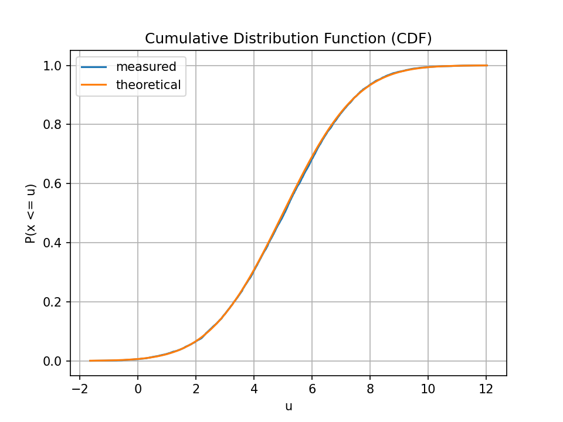
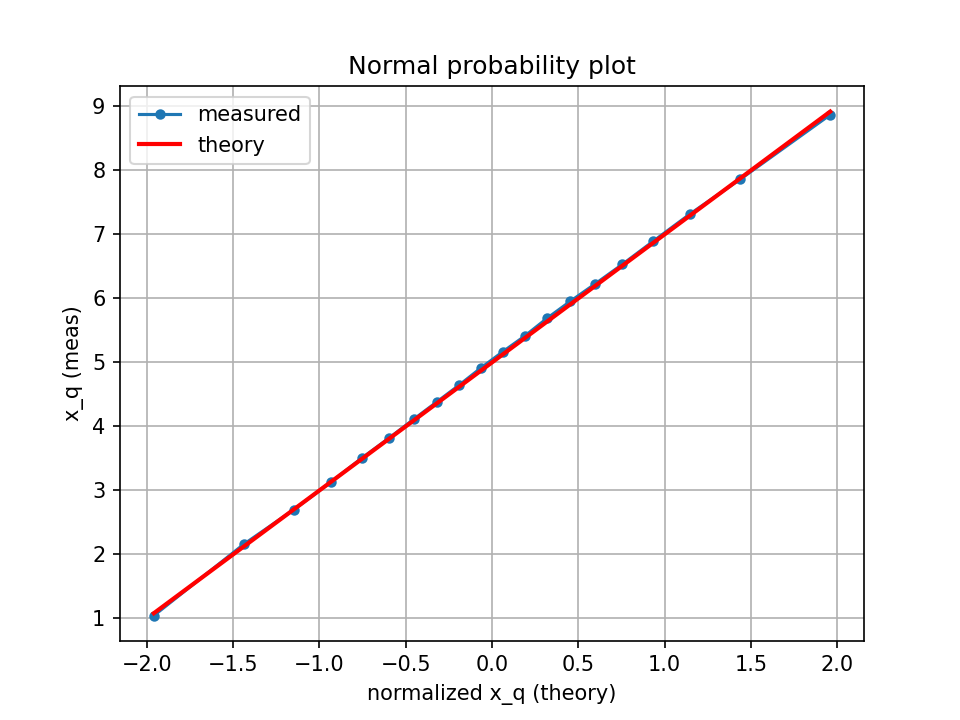
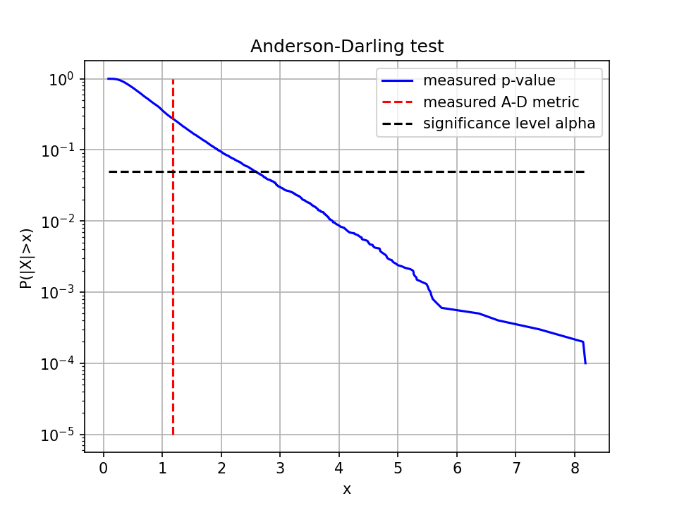
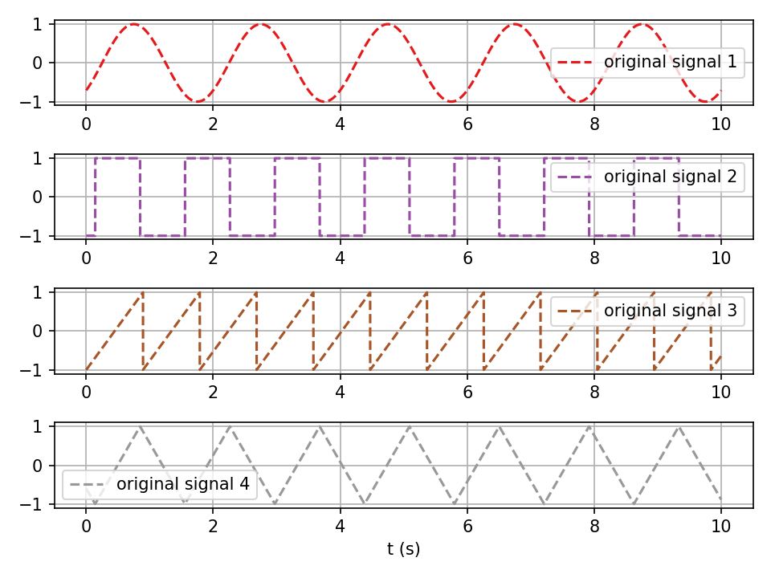
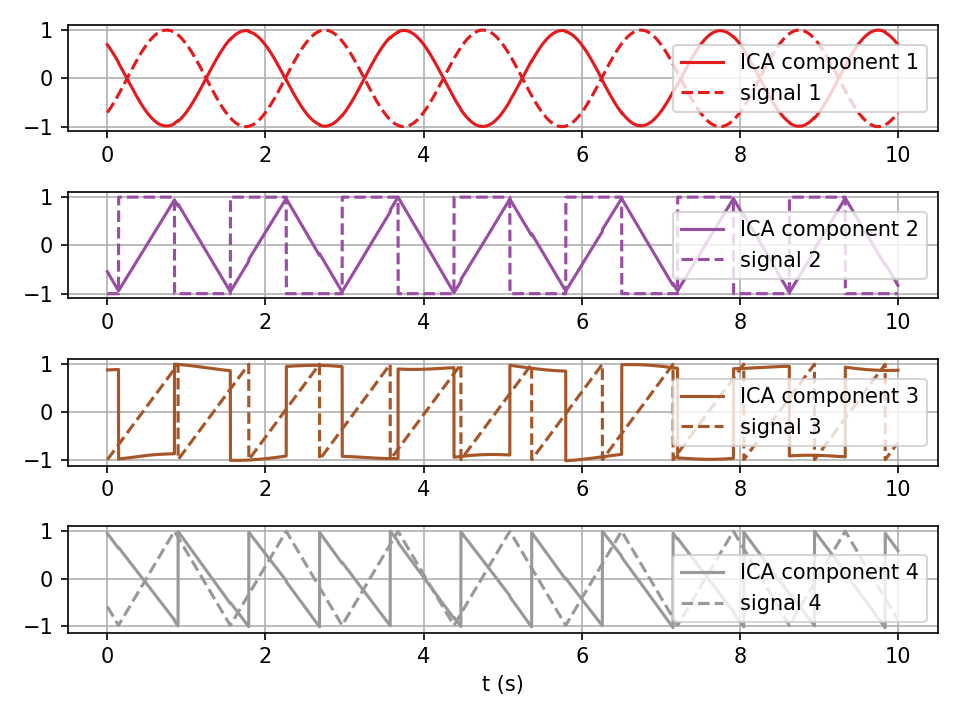

# EEG Signal Processing — CLT, Gaussianity Tests & FastICA

## Objective

Two interrelated experiments:
1. **Central Limit Theorem & Gaussianity Testing** — Generate approximate Gaussian samples using CLT and Box-Muller, then verify Gaussianity with multiple statistical tests
2. **Blind Source Separation with FastICA** — Recover independent source signals from linear mixtures (cocktail party problem)

---

## Part 1: Central Limit Theorem & Gaussianity Tests

### Approach
- **CLT**: Sum of $N = 10$ independent uniform random variables → approximately Gaussian
- **Box-Muller**: Exact transformation from uniform to Gaussian
- **Gaussianity verification**: t-score, excess kurtosis, Anderson-Darling test, with p-values estimated via Monte Carlo simulation (10,000 experiments)

### Results

| | |
|:---:|:---:|
|  |  |
| CLT: uniform + Gaussian histograms vs theory | Measured vs theoretical CDF |

| | |
|:---:|:---:|
|  |  |
| Normal probability plot (Q-Q) | Anderson-Darling p-value test |

### Statistical Test Results

| Test | Statistic | Interpretation |
|------|:---------:|----------------|
| **t-score** | 0.844 | Well below critical value → mean consistent with $\mu = 5$ |
| **Excess kurtosis** | 0.086 | Close to 0 (Gaussian has kurtosis = 0) |
| **Anderson-Darling** | $a^2 = 1.18$ | Passes at standard significance levels |

> With just $N = 10$ uniform variables, the CLT sum passes all Gaussianity tests, demonstrating the rapid convergence of the theorem.

---

## Part 2: FastICA — Blind Source Separation

### Approach
- 4 independent source signals: sinusoidal, square wave, sawtooth, triangular
- Linearly mixed via a random $4 \times 4$ matrix: $Y = A \cdot X$
- **FastICA** (deflation algorithm) recovers the original sources from the mixtures
- Comparison with **PCA** to show that decorrelation alone is insufficient

### Results

| | |
|:---:|:---:|
|  |  |
| Original source signals | FastICA recovered components |

### Key Findings

- **FastICA successfully recovers all 4 sources**, subject to permutation and sign/scaling ambiguity (inherent ICA limitations)
- **PCA fails** to separate the sources — it only decorrelates, while ICA achieves true statistical independence
- The experiment confirms that ICA works well for non-Gaussian sources, as the algorithm maximizes non-Gaussianity of the components

## Files

| File | Description |
|------|-------------|
| `central_limit_theorem.py` | CLT/Box-Muller generation + 4 Gaussianity tests with Monte Carlo p-values |
| `fastica_bss.py` | Blind source separation: signal generation, mixing, FastICA vs PCA recovery |
